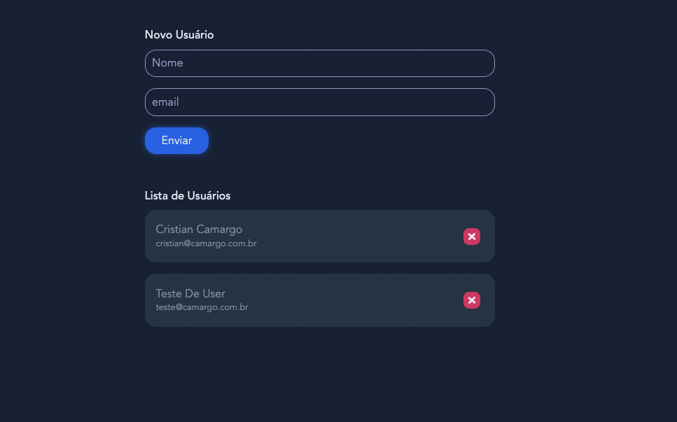

# Introdução ao Full Stack

## Tecnologias Utilizadas.
- Vue JS
- NodeJS
- Express
- TypeScript
- Axios
- Normalize CSS
- HTML
- CSS
- JavaScript


## Front End com Vue JS.

### O que eu aprendi ?

- Introdução ao Vue JS
- Diretivas,
- Uso de Methods, e ganchos como Created,
- Criar elemenentos com lop em arrays.
- Importar estilos globais
- Css nos componentes
- Componentização no Vue Js
- Vue CLI
- Plugar Vue em projetos ja existentes.
- Utilizar axios para requisições HTTP
- Tipar nossa aplicação com Typescript


### Criamos uma aplicação simples para consumir nosso back end.

- Listamos os usuários que vem do Back End
- Criamos Usuários
- Deletamos Usuários.

## Screenshot do Front End



## Back End com NodeJS, Express e TypeScript

- Configuramos a API para usar Express
- Configuramos o CORS da API, para receber as requisições
- Criamos um método de listar usuários da API
- Criamos um método de Criar usuários na API
- Criamos um método de Atualizar usuário na API
- Criamos um método de Deletar usuário da API

<br><br><br>

## Para Rodar a aplicação Front End
<br>

- Primeiro instalamos as dependencias com: 
```
  npm install

```

- Depois de instalar as dependencias podemos executar a Aplicação com:
```
  npm run dev

```

- Para compilar para produção usamos :
```
  npm run build

```

<br><br>

## Para Rodar a aplicação Back End
<br>

- Primeiro instalamos as dependencias com: 
```
  npm install

```

- Depois de instalar as dependencias podemos executar a Aplicação com:
```
  npm run dev

```

- Para compilar para produção usamos :
```
  npm run build

```